# Solana Block Monitor

A high-performance Solana block monitoring service that provides real-time slot confirmation through an intelligent synchronization system and HTTP API.

## Features

- **Real-time Block Synchronization**: Continuously monitors and caches confirmed Solana blocks
- **Intelligent Interval Processing**: Reduces RPC calls by processing slots in optimized intervals  
- **High-Performance Caching**: In-memory cache with configurable size and LRU eviction
- **Parallel Processing**: Multi-worker architecture for efficient historical data processing
- **HTTP API**: Simple REST endpoint for slot confirmation checks
- **Comprehensive Metrics**: Built-in performance monitoring and logging
- **Syndica RPC Integration**: Leverages high-performance RPC endpoints

## Architecture Overview


## Synchronization Algorithm

The synchronizer uses a interval-based processing system designed to minimize RPC traffic 
while maintaining real-time block monitoring.

### Core Components

#### 1. Dual Task System


**Slot Updater Task:**

- Polls latest slot every configured interval (default: monitor_interval_ms)
- Creates slot intervals from last tracked position to current slot
- Maintains monitoring depth to avoid processing too many historical slots
- Pushes intervals to processing queue

**History Updater Task:**

- Manages worker pool (default: 5 workers)
- Distributes interval processing across workers
- Handles worker lifecycle and error recovery

#### 2. Interval-Based Processing

Instead of checking individual slots, the system processes ranges of slots to optimize RPC usage:

```mermaid
graph LR
    A[Start Slot: 1000] --> B[End Slot: 1100]
    B --> C{RPC Call: getBlocks}
    C --> D[Confirmed: 1001,1003,1050,1099]
    D --> E[Cache Confirmed Slots]
    E --> F[Create Sub-intervals]
    F --> G[Gap 1: 1002-1002]
    F --> H[Gap 2: 1004-1049] 
    F --> I[Gap 3: 1051-1098]
    G --> J[Queue if size ≥ 5]
    H --> J
    I --> J
```



**Interval Processing Logic:**

1. **Fetch blocks** for the entire interval using `getBlocks(start, end)`
2. **Identify gaps** between confirmed blocks
3. **Create sub-intervals** for unprocessed gaps
4. **Queue sub-intervals** that meet minimum size requirements
5. **Cache confirmed slots** for fast future lookups

#### 3. Adaptive Queue Management

The system uses intelligent queuing to balance throughput and resource usage:

- **Minimum interval size**: 5 slots (prevents excessive fragmentation)
- **Preferred interval size**: 100 slots (balances RPC efficiency and memory usage)
- **Queue backpressure**: Workers sleep when queue is empty
- **Error handling**: Failed intervals are re-queued for retry

### Performance Optimizations

1. **Cache-First Strategy**: Always check cache before making RPC calls
2. **Batch Processing**: Process multiple slots in single RPC call
3. **Worker Throttling**: Configurable delays between worker operations
4. **Memory Efficiency**: LRU cache with bounded size
5. **Concurrent Processing**: Multiple workers process different intervals simultaneously

## Business Logic Layer

The `SyndicaAppLogic` struct provides the core business logic with integrated caching and metrics:

### Key Operations


### Core Methods

- **`get_block(slot)`**: Check single slot confirmation with caching
- **`get_blocks(start, end)`**: Fetch block range with metrics
- **`get_latest_slot()`**: Get current blockchain head
- **`update_latest_slot()`**: Initialize synchronizer starting point
- **`query_slot_range(start, end)`**: Batch process and cache slot ranges

### Metrics Collection

The logic layer automatically collects performance metrics:

- Cache hit/miss ratios
- RPC call latencies
- Slot confirmation response times
- Latest slot tracking

## HTTP Server

The server provides a simple REST API built with the Axum web framework:

### Endpoint: `GET /isSlotConfirmed/{slot}`

**Purpose**: Check if a specific slot is confirmed on the Solana blockchain

**Parameters:**

- `slot` (u64): The slot number to verify

**Response Codes:**

- `200 OK`: Slot is confirmed and cached
- `404 Not Found`: Slot is not confirmed  
- `500 Internal Server Error`: RPC error or system failure

**Example Usage:**

```bash
# Check if slot 12345 is confirmed
curl http://localhost:3000/isSlotConfirmed/12345

# Response: HTTP 200 OK (confirmed) or 404 Not Found
```

### Performance Characteristics

- **Cache Hit**: Sub-millisecond response time
- **Cache Miss**: 10-100ms depending on RPC latency
- **Concurrent Requests**: Handled efficiently through shared cache
- **Auto-scaling**: Background synchronization improves cache hit rates over time

## Configuration

### Environment Variables

```bash
# Syndica RPC endpoint
SOLANA_RPC_URL=https://solana-mainnet.syndica.io/access-token/YOUR_TOKEN

# Server configuration  
PORT=3000
LOG_LEVEL=info

# Synchronization settings
MONITOR_INTERVAL_MS=1000
MONITORING_DEPTH=1000
```

### Tuning Parameters

- **Workers**: Adjust `WORKERS_COUNT` for processing throughput
- **Interval Size**: Modify `INTERVAL_SIZE` to balance RPC efficiency
- **Cache Size**: Configure cache capacity based on memory constraints
- **Monitoring Depth**: Control how far back to synchronize historical data

## Running the Service

### Prerequisites

- Rust 1.82+ installed
- Syndica RPC access token
- Network connectivity to Solana RPC endpoints

### Setup

1. **Clone repository**:

   ```bash
   git clone <repository-url>
   cd solana-block-monitor
   ```

2. **Configure environment**:

   ```bash
   cp .env.example .env
   # Edit .env with your Syndica RPC URL and settings
   ```

3. **Build and run**:

   ```bash
   cargo build --release
   cargo run --release
   ```

4. **Development mode**:

   ```bash
   cargo run
   ```

### Testing

```bash
# Run unit tests
cargo test

# Run with logging
RUST_LOG=debug cargo test

# Test specific module
cargo test synchronizer
```

## Future Enhancements

### Planned Features

1. **Database Integration**: Persistent storage for historical data
2. **Rate Limiting**: Protect against API abuse
